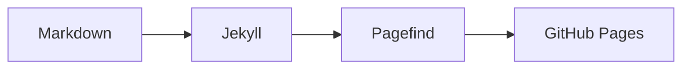

# Y2 Blog

## 构建

首次安装前端构建依赖：

```sh
npm ci
```

之后统一通过构建脚本生成 Jekyll 页面和本地搜索索引：

```sh
bin/build
```

## 快速创建推文

用 `bin/new-post` 可以在 `_posts` 下生成新的 Jekyll 文章草稿：

```sh
bin/new-post "文章标题"
```

常用选项：

```sh
bin/new-post -c ctf -t "pwn parser" "CTF 题目记录"
bin/new-post -c binary -d 2026-06-17 --slug vmware-notes "VMware 笔记"
bin/new-post -e "随手记"
```

默认会创建到 `_posts/unclassified/`，日期使用今天，文件名由标题自动生成。同名文件不会被覆盖，会自动追加数字后缀。

## 在文章中插入卡片

将标准 Markdown 自动链接独占一行，构建时会自动转换成卡片：

```markdown
<https://example.com/article>
```

精确指向 `github.com/owner/repository` 的链接会自动变成 GitHub 仓库卡片，其他 HTTP(S) 链接使用通用链接预览：

```markdown
<https://github.com/owner/repository>
```

普通的行内链接和 `[title](url)` 命名链接不会转换。GitHub 卡片会在浏览器中读取公共 API，并展示仓库简介、语言、Stars、Forks、License 和最近更新时间。请求结果会在浏览器本地缓存 6 小时；API 不可用时，卡片仍可作为普通 GitHub 链接使用。

## 正文组件

需要给普通行内文字补一段悬停故事时，使用 `[显示文字]{悬停内容}`。它可以出现在任何 Markdown 段落或列表中；桌面端悬停、键盘聚焦或移动端点按显示内容：

```markdown
我是一个 [连环画爱好者]{在课程报告、演讲 slides 中过少使用文字。}。
```

显示文字和悬停内容目前只接受纯文本；需要写出字面量的 `]`、`}`、`<` 或 `>` 时，在它前面加反斜杠。行内代码、代码块、HTML 标签和 Liquid 标签中的相同写法不会转换。

Callout 使用 Obsidian/GitHub 风格的 Markdown 语法，支持 `note`、`tip`、`warning`、`danger` 和 `important`：

```markdown
> [!warning] 注意
> 这里可以写 **Markdown**。
>
> 也可以写多段、列表和代码块。
```

需要手动覆盖通用链接卡片的 `title`、`description` 或 `image` 时，仍可以使用高级 include 写法：

```liquid

```

自动预览会把该 URL 发送给 Microlink 获取公开元数据，并在浏览器本地缓存 24 小时；接口或预览图不可用时会自动降级为纯文字链接。旧的 `callout.html`、`github_repo.html` 和 `link_preview.html` include 写法仍然兼容。

## Mermaid 图表

使用标准的 `mermaid` fenced code block，无需在文章 front matter 中增加开关。只有包含图表的页面才会按需加载本站托管的 Mermaid：

````markdown

````

正式文章中的图表至少填写一行 `accTitle`；复杂图表再使用 `accDescr` 描述图中表达的关系。`bin/build` 会在生成站点前检查所有 Mermaid code block 的语法，并提示缺少 `accTitle` 的图表。渲染失败或浏览器禁用 JavaScript 时，页面会保留可读的图表源码。

静态推文不加载 X 的第三方脚本，头像和配图均为可选项：

```liquid

```
