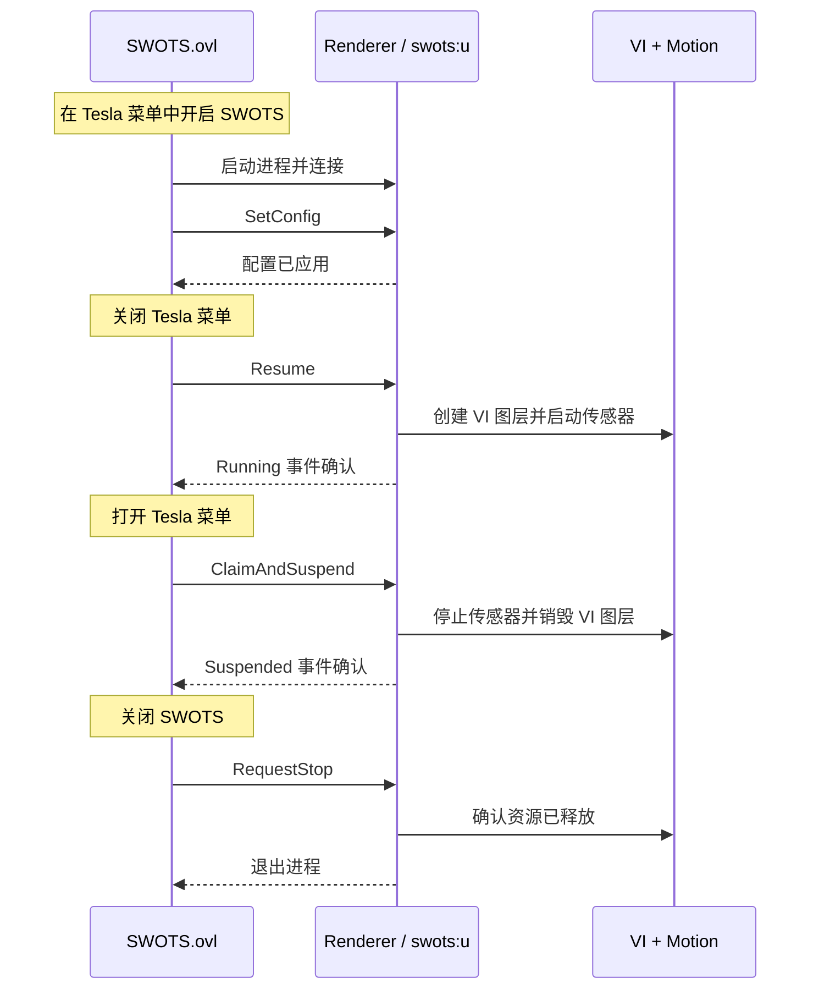

我不知道有没有人和我一样在地铁上都™会晕车。但是呢我又很想在地铁上打游戏。

好在现在是 AI 时代，就算只有我一个人有这种需求，我也可以花一天时间和 AI 对话写出一个基于大气层的防晕动症后台服务。

<https://github.com/cameudis/SWOTS>

## 晕车与防晕车原理

晕车的原理是我们耳朵里感受平衡的器官在物理层面感受到“身体正在经历加速度/振动”，但是眼睛看到的信息是“身体和周围的物体保持静止”，这两种信息在发送给我们的大脑后，它很难不认为自己是吃菌子中毒了，于是开始头晕催促人去休息+催吐让人把有毒的东西都吐出来。

3D 眩晕的原理其实也是这样的：耳蜗感受到“身体静止”，但眼睛看到“身体在移动”，所以以一种与晕车正好相反的方式实现了头晕（太棒了）。

> [!note] 另外
> 不得不提起笔者小时候玩过的 $$xD (x\ge 4)$$ 影院，虽然耳蜗和眼睛都感受到身体在动，但可能是因为动得太不自然了，导致笔者一下来就巨晕想吐，有没有懂的。

所以，只要眼睛和耳蜗同步感受到“身体在经历加速度/振动”，大脑就不会认为我们中毒了。

### 防晕车软件

现在市面上最常用的防晕车软件都采用类似的动态视觉提示方法，在屏幕上显示多个半透明圆点，根据手机传感器信息移动，来让用户得到移动的视觉信息。

在 iOS 系统上，这个 [车辆运动提示](https://support.apple.com/zh-cn/guide/iphone/iph55564cb22/ios) 功能是自带的，而且 iOS 26 更新了个性化！可惜我不用 iPhone。

>  如果在作为乘客乘坐轿车或其他道路车辆且使用 iPhone 时感到不适，你可以打开车辆运动提示，即可能有助于缓解晕动症的屏幕提示。车辆运动提示在屏幕边缘显示为动态圆点，它们代表车辆移动的方式并且不会干扰你在 iPhone 上执行的操作。

安卓也有一两个著名的防晕车应用（出得还比 iOS 的这个功能早）叫 [KineStop](https://play.google.com/store/apps/details?id=com.urbandroid.kinestop)（这个开发团队还开发过其他许多著名的安卓软件，比如下载次数已破千万的 [Sleep as Android](https://play.google.com/store/apps/details?id=com.urbandroid.sleep)）。这个软件让我突破了从零到一的限制：我从完全不能在车上用手机，变成了*可以*在车上用手机。

软件的效果也受限于设备提供的性能，因为如果手机在省电模式下，就会因为帧率、芯片降频等原因导致软件显示效果“不跟手”，防晕车大打折扣。所以我在车上还是能不用手机就不用手机！

当然也存在许多其他的方案，比如 [这篇综述](https://arxiv.org/abs/2402.00565) 不仅介绍了晕车的原理，还介绍了除了圆点以外的好多种缓解晕车的方法。笔者目前还没有阅读这篇论文，但之后肯定会继续研究，为了我能在地铁上玩游戏。

## Switch 大气层开发背景

显然普通的 switch 是不允许我开发一个覆盖全屏的软件并放上去跑的！我的 switch 经过了神秘力量的魔改，可以运行自定义的固件 [Atmosphère](https://github.com/Atmosphere-NX/Atmosphere)，这套固件对 switch 原生的 Secure Monitor、Horizon 内核和用户态系统服务等组件都做了 patch，从而允许用户安装自制软件（以及关闭游戏签名校验、金手指等邪恶操作）。

在 switch 上开发自制软件（homebrew）之所以成为可能，真是要好好感谢那些逆向哥们了。他们维护了一个网站 [Nintendo Switch Brew](https://switchbrew.org/)，记录了关于 switch 的公开/逆向得来的各种资料，比如有关于 [Horizon/NX 内核](https://switchbrew.org/wiki/Kernel) 的、关于 [JoyCon 手柄](https://switchbrew.org/wiki/Joy-Con) 的、关于 [TrustZone Secure Monitor](https://switchbrew.org/wiki/Secure_Monitor) 的……

在这些~~黑魔法~~资料之上，诞生了 switch 自制软件的生态：用户态系统编程库 [libnx](https://github.com/switchbrew/libnx) 允许开发者方便地调用到内核提供的多种接口，包括进程资源管理、IPC、文件系统、各种 I/O 设备如手柄、陀螺仪、触摸屏、图形显示和 GPU、音频、网络、USB、蓝牙……另外，[devkitPro](https://devkitpro.org/) 这个组织为 Nintendo wii、gamecube、ds、gba、gamepark gp 32 以及 Switch 这些游戏机都维护了自制软件的开发工具链。

I mean，看到大家都这么努力，哪个开发者不想急头白脸哼哧哼哧开发点软件上去？

## 开发与测试

我感到在现代，以前那些配环境问题、程序骨架、API 调用方法这些所有的东西都已经不需要人类参与了。当然我还是可以放一个如何配好开发环境的链接在这里：[Setting up Development Environment - Nintendo Switch Brew](https://switchbrew.org/wiki/Setting_up_Development_Environment)。

国产模型的巅峰水平似乎还无法 handle 这个 task。我使用 GLM 5.2 + 官方的 GUI Agent [ZCode](https://zcode.z.ai/cn) 尝试进行骨架的开发，花了两个小时还无法做到真机运行。然后我使用 GPT 5.6 Sol 进行开发，果然一下子就发现了 GLM 5.2 代码中的问题，两三个来回就跑通了，真棒👍。

>  你可能会问我如何抢到 GLM 5.2 套餐的，答案是我根本就没有抢。推荐大家可以试试 [Ollama Pro](https://ollama.com/pricing)，一个月二十刀略贵、但真的可以用上流畅的 GLM 5.2 等开源模型。
>  另外我不得不强调一下我是智谱的忠实粉丝，他们的 ZCode 似乎是全世界唯一一款原生支持 Linux 的 GUI Agent 软件。当我在 ZCode 官网上看到 Tux🐧的瞬间，我知道智谱已经遥遥领先，成为 Anthropic 最严厉的父亲。

我通过 DBI + USB 将 Switch 接入电脑，这样 Agent 可以直接部署程序，不用我每次把 SD 卡拔下来插电脑上。当然这种方法的缺点就是，每次都要去相册里面开这个文件服务器有点烦，不知道有没有更方便的做法。

## 软件架构

Switch 上面有一个生态里非常著名的 Tesla Menu，是一个可以任意时刻呼出的侧栏菜单，可以通过这个菜单快捷调用程序，比如超频、金手指、系统状态、帧率显示等。SWOTS 项目也选择 Tesla Menu 作为交互入口，软件整体分为两个部分：

- `SWOTS.ovl`：基于 [libtesla](https://github.com/WerWolv/libtesla) 开发的 Tesla Menu 入口，实现了设置与开关的界面
- `SWOTS.nsp`：后台运行的 Renderer 服务，读取传感器数据并实现晕动提示渲染

两者之间通过 Switch 上的 IPC 机制通信，文档见 [HIPC - Nintendo Switch Brew](https://switchbrew.org/wiki/HIPC)。具体来说，HIPC (Horizon Inter-Process Communication) 是 switch 内核的 IPC 实现，在用户态有两套上层协议，分别是这个项目使用的 CMIF（全称可能是 Command Interface）和 TIPC（Tiny IPC）。

Renerder 会在启动时注册一个 CMIF 服务 `swots:u`，用以接受 IPC 通信：

```cpp
smRegisterServiceCmif(..., "swots:u", ...);
```

入口进程 `SWOTS.ovl` 会按照这个名字找到服务并连接：

```cpp
smGetService(..., "swots:u");
```

 `SWOTS.ovl` 包括一个 UI 相关线程（主线程 / HID 线程）和 IPC Worker 线程，这种设计是为了防止 IPC Worker 卡住导致 UI 也同步卡住、使用户无法操作。
 
 当用户和菜单进行交互、按下启动 SWOTS 时，IPC Worker 会通过 Process Manager 系统服务启动一个 Renderer 进程并连上它注册的 CMIF 服务，开始通信。
 
 由于 Tesla Menu 和 SWOTS 的悬浮显示是冲突的，所以当 `SWOTS.ovl` 检测到用户退出 Tesla 菜单的时候，它会给 Renderer 发送 `Resume` 命令，此时 Renderer 才正式开始渲染工作。

两者的具体交互可以看下面这个图：



---

在下一篇博客中，我将会介绍软件的核心部分算法，未完待续。